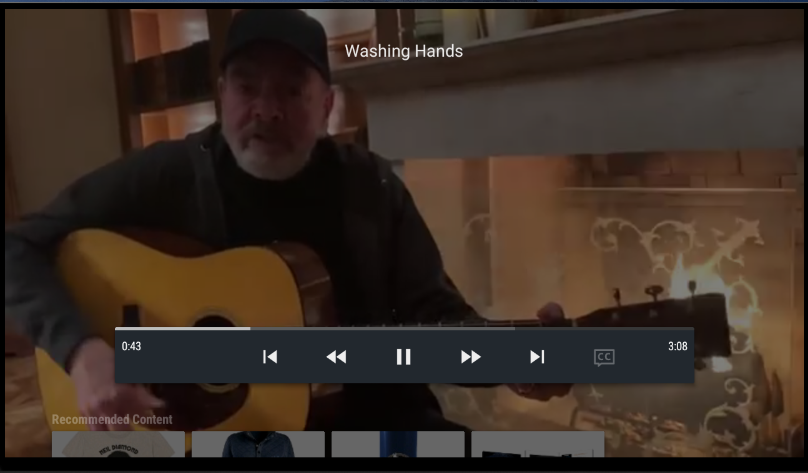

	

Pay TV (PTV)
---

Pay TV (PTV) - A FireTV app for engaging with live content and supporting content creators such as musicians and streamers.

### Screenshots
<h3>Netflix style app for discovering artists from your TV</h3>

<h3>Search for artists using your TV</h3>

<h3>Watch live content and support artists in the pandemic</h3>

<h3>Pay for items directly from your TV with a few clicks using your PayID</h3>

### Useful links
* https://github.com/xpring-eng/Xpring-SDK-Demo/blob/master/java/src/main/java/io/xpring/demo/PayIdDemo.java
* https://github.com/xpring-eng/Xpring-SDK-Demo/tree/master/java
* https://github.com/xpring-eng/xpring4j
* https://docs.payid.org/xpring-sdk-payid-get-started

